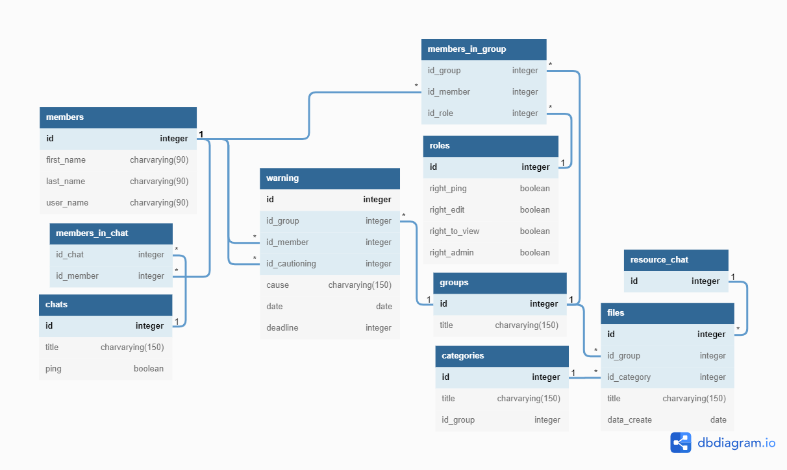

# Проект телеграмм-бот на языке Java

### Схема Базы Данных

https://dbdiagram.io/d/62696c4995e7f23c6184fe24

###

##### О боте

    Бот для упрощения процесса работы в рабочих чатах 
        - Группы участников в чате
        - Пинг
        - Файловая система
        - Предупреждения участникам

##### Инструментарий

    База Данных: Postrges 
    IDE: InteliJ IDEA
    Язык Программирования: Java 
    Версия: 17.0.2
    Frameworks: 
        Postgresql
        Lombok
        Log4j
        JUnit
        Java Telegram Bot API

##### Пользовательский интерфейс

    Обработка сообщений
    
        -бот добавлен в чат
            -создать чат в бд
        
        -бот удален из чата
            -удалить чат из бд
        
        -человек зашел в чат
            -добавить в человека в бд и в список участников чата
        
        -человек вышел из чата
            -удалить человека из списка участников чата
            -если человека нет больше не в одном чате - удалить из бд.
        
        -Состояния

        /menu
        (меню)
            <Добавить группу 
                (Добавление группы)
                >ввод названия - откат обратно к меню
            <список групп
                (Список групп)
                <<Список групп>>
                        (Группа)
                        <Файловая система
                            (Файловая система)
                            <Добавить Категорию
                                (Добавление категории)
                                >ввод названия - откат к (Файловая система)
                            <Список Категорий
                                (Список категорий)
                                <<Список категорий>>
                                    (Категория)
                                    <Удалить категорию - откат к (Список категорий)
                                    <Редактировать категорию
                                    (Редактирование категории) - откат к (Категория)
                                
                            
                            <Добавить файл
                                (Добавление файла: Выбор категории)
                                <<Список категорий>>
                                    (Добавление файла: Добавление файла)
                                    >добавление файла
                            
                            <Списки файлов
                                (Списки Файлов)
                                <Категория и дата
                                    (Категория и дата: Выбор категории)
                                    <<Список Категорий>>
                                        (Категория и дата: Ввод даты)
                                        >ввод даты - откат к (Списки файлов)
                        
                        <Добавить Участников в группу
                            (Добавление участников) - собрать всех участников чатов в которых есть этот пользователь
                            <<Список не участников>> - откат к (Добавление Участников)
                        
                        <Список Участников группы (с варнами и ролями)
                            (Список Участников группы)
                            <<Список участников группы>>
                                (Участник)
                                <удалить участника
                                <изменить роль
                                    (Роль участника)
                                    <<Список ролей>> - откат к (Список участников группы)

        -обычное сообщение
            -добавить человека в чат

##### Сущности(устарело)

    Участник
        id integer [pk] 
        first_name charvarying(90) [NOT NULL]
        last_name charvarying(90)
        user_name charvarying(90)

    Чат
        id integer [pk]
        title charvarying(150) [NOT NULL]
        ping boolean [NOT NULL, DEFAULT: false]

    Группа
         id integer [pk, increment]
        title charvarying(150) [NOT NULL]

    Роль
        id integer [pk, increment]
        title charvarying(150) [NOT NULL]
        right_ping boolean [NOT NULL]
        right_edit boolean [NOT NULL]
        right_to_view boolean [NOT NULL]
        right_admin boolean [NOT NULL]

    Категория
        id integer [pk, increment]
        id_group integer [ref: > groups.id]
        title charvarying(150) [NOT NULL]

    Файл
        id integer [pk]
        id_category integer [pk, ref: > categories.id]
        title charvarying(150) [NOT NULL]
        data_create date [NOT NULL]

    Предупреждение
        id integer [pk, increment]
        id_group integer [NOT NULL, ref: > groups.id]
        id_member integer [NOT NULL, ref: > members.id]
        id_cautioning integer [NOT NULL, ref: > members.id]
        cause charvarying(150) [NOT NULL]
        date date [NOT NULL]
        deadline integer [NOT NULL]

##### Методы работы с Базой Данных - сокращено dao

    Участники (реализовано)
        создать участника - реализован принцип не повторяемости 
        изменить участника
        удалить участника

    Чат (реализовано)
        добавить участника - реализован принцип не повторяемости
        удалить участника

        создать чат - реализован принцип не повторяемости
        изменить правило

        выдать всех участников

    Группа (реализовано)
        добавить участника (добавить стандартную роль) - реализован принцип не повторяемости
        изменить участника -изменить роль участника
        удалить участника
        удалить всех участников

        выдать список ролец

        создать группу - автоматическая очередь
        изменить группу
        удалить группу
            &удалить всех участников
            &удалить все варны
            &удалить все файлы
            &удалить все категории

        добавить варн участнику - автоматическая очередь
            *остановить варн
        удалить варн у участника
            *запустить варн
        удалить все варны у участника
        удалить все варны у участников

        запустить варн
        отключить варн

        выдать все варны

        проверить все варны
            *удалить варн

        выдать всех участников - со списком ролей и количеством варнов
        выдать всех участников группы в чате

    Файлы группы (реализовано)
        добавить файл - реализован принцип не повторяемости
        изменить файл
        удалить файл
        удалить все файлы

        добавить категорию
        изменить категорию - автоматическая очередь
        удалить категорию
        удалить все категории

        выдать все категории

        выдать все файлы с ограничением по дате
        выдать файлы категории с ограничением по дате

##### Рабочие комментарии

    функция - обрезка -100 в айдишнике
    date - null когда не работает
    одного пользователя не взять))

    по необходимости договориться об общем интрефейсе
    поставить посгрес на сервер
    
    Пользовательский интерфейс переделать

    каскадное удаление всего

    при необходимости дописать возможности получать данные

    GENERATED ALWAYS AS IDENTITY

    ON CONFLICT (id) DO NOTHING
    
     ON DELETE CASCADE
    
    